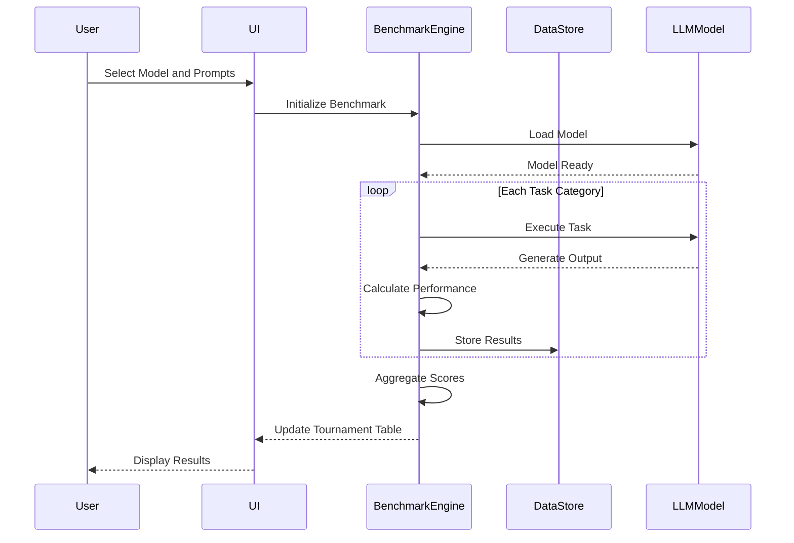

# UI Mockups

## Core Functionalities

1. **Tournament Table Management**

   - Dynamic table of LLMs with sortable columns
   - Two-way binding for input cells
   - Detailed stats panel on cell click
   - Automatic point calculation and live updates

2. **Benchmarking Workflow**

   - Task management across 5 different evaluation categories
   - Output capture and storage
   - Performance metrics tracking
   - Speed and quality scoring system

3. **Prompt Management**

   - Centralized prompt library
   - Easy navigation and selection of prompts
   - Custom prompt creation and editing

4. **Results Visualization**
   - Statistical charts and graphs
   - Export capabilities (Markdown, CSV)
   - Read-only table view
   - Detailed performance profiles

```
+========================================================+
| LLP: Lightweight LLM Benchmarking Tool                 |
+========================================================+
| [Tournament]  [Prompts]  [Stats]  [Export]  [Settings]  |
+--------------------------------------------------------+
| Tournament Table                                       |
+------------------------+--------+-------+------------+ |
| Model Name            | Booting| Prog. | Total Score| |
| qwen2.5-coder-32b     |   85   |  920  |   1005     | |
| gemma-2-27b-it        |   90   |  880  |    970     | |
| Llama-3.3-70B         |   95   |  950  |   1045     | |
+------------------------+--------+-------+------------+ |
| [Detailed View]  [Sort]  [Filter]  [Refresh]           |
+--------------------------------------------------------+
| Detailed Stats for: Llama-3.3-70B                      |
| Context Length: 8192                                   |
| GPU Layers: Full                                       |
| Booting Speed: 95/100                                  |
| Programming Score: 950/1200                            |
+--------------------------------------------------------+
| Task Progress: [████████████████] 85%                  |
+========================================================+
```

Key Interface Components:

1. Navigation Tabs

   - Tournament: Main benchmarking view
   - Prompts: Manage and select prompts
   - Stats: Performance charts and graphs
   - Export: Save/share results
   - Settings: App configuration

2. Tournament Table

   - Sortable columns for model performance
   - Live-updating scores
   - Clickable rows for detailed model statistics

3. Detailed Model View
   - Comprehensive performance metrics
   - Task-specific breakdowns
   - Visual progress indicators

## Core Module Designs

I'll outline the primary modules for the LLP application:

1. **Data Management Module**

   - SQLite database integration
   - Model and benchmark data storage
   - CRUD operations for LLM records

2. **Benchmarking Engine**

   - Task execution framework
   - Performance metric calculation
   - Result aggregation and scoring

3. **UI Rendering Module**

   - BubbleTea-based terminal interface
   - State management
   - Interactive components

4. **Export and Reporting Module**
   - Markdown and CSV export
   - Statistical report generation
   - Visualization helpers



---

```
+========================================================+
| LLP: Lightweight LLM Benchmarking Results Tracker      |
+========================================================+
| [Tournament] [Ingest] [Prompts] [Stats] [Export]       |
+--------------------------------------------------------+
| Tournament Performance Overview                        |
+------------------------+-------+-------+-------+-------+
| Model Name            | Boot  | Prog. | Gen.  | Total |
+------------------------+-------+-------+-------+-------+
| Llama-3.3-70B         |  95/  |  920/ |  850/ |  1865/|
|                       |  100  | 1200  | 1145  | 3245  |
| Gemma-2-27B           |  90/  |  880/ |  820/ |  1790/|
|                       |  100  | 1200  | 1145  | 3245  |
| Qwen2.5-32B           |  85/  |  900/ |  840/ |  1825/|
|                       |  100  | 1200  | 1145  | 3245  |
+------------------------+-------+-------+-------+-------+
| [Ingest Result] [Sort] [Filter] [Refresh]              |
+========================================================+
```

Key Features:

- Comprehensive tournament table
- Scores across different task categories
- Quick actions for result ingestion

---

```
+========================================================+
| LLP: Result Ingestion                                  |
+========================================================+
| [Tournament] [Ingest] [Prompts] [Stats] [Export]       |
+--------------------------------------------------------+
| Ingest New Model Results                               |
+--------------------------------------------------------+
| Select Task Category:                                  |
| > Booting         [ ]                                  |
| > Programming     [ ]                                  |
| > General         [*]                                  |
| > AGI Probing     [ ]                                  |
| > Creative Writing[ ]                                  |
| > Software Eng.   [ ]                                  |
+--------------------------------------------------------+
| Select Model:                                          |
| > Llama-3.3-70B-Instruct-IQ2_XXS.gguf        [▼]       |
+--------------------------------------------------------+
| Prompt Details:                                        |
| Complexity Level: 3 - Moderate Prompts                 |
| Points Allocated: 140 points                           |
+--------------------------------------------------------+
| Performance Metrics:                                   |
| Speed: [ 2.28 tok/sec ]                                |
| Total Tokens: [ 476 ]                                  |
| Time to First Token: [ 69.21s ]                        |
+--------------------------------------------------------+
| Paste Output Below:                                    |
| ────────────────────────────────────────────────────── |
| [                                                    ] |
| [                                                    ] |
| [                                                    ] |
| ────────────────────────────────────────────────────── |
| [Validate] [Save Output] [Calculate Points]            |
+========================================================+
```

Key Features:

- Comprehensive task and model selection
- Detailed prompt context
- Performance metric input
- Output paste and validation

---

```
+========================================================+
| LLP: Prompt Management                                 |
+========================================================+
| [Tournament] [Ingest] [Prompts] [Stats] [Export]       |
+--------------------------------------------------------+
| Prompt Library                                         |
+--------------------------------------------------------+
| Categories:                                            |
| > Booting            (1/1 prompts)                     |
| > Programming       (16/16 prompts)                    |
| > General           (25/25 prompts)                    |
| > AGI Probing       (12/12 prompts)                    |
| > Creative Writing   (8/8 prompts)                     |
| > Software Eng.      (2/2 prompts)                     |
+--------------------------------------------------------+
| Selected Category: General                             |
+--------------------------------------------------------+
| Complexity Level 3: Moderate Prompts                   |
+------------------------+--------+------------+----------+
| Prompt Title          | Points | Complexity | Status   |
+------------------------+--------+------------+----------+
| Complex Reasoning     |   20   |    Med     | Unused   |
| Ethical Dilemma       |   20   |    Med     | Used     |
| Technical Analysis    |   20   |    Med     | Unused   |
+------------------------+--------+------------+----------+
| [New Prompt] [Edit] [Delete] [Export Category]         |
+========================================================+
```

Key Features:

- Organized prompt categorization
- Complexity and point tracking
- Management actions

---

```
+========================================================+
| LLP: Performance Statistics                            |
+========================================================+
| [Tournament] [Ingest] [Prompts] [Stats] [Export]       |
+--------------------------------------------------------+
| Overall Performance Metrics                            |
+--------------------------------------------------------+
| Total Models Benchmarked: 24                           |
| Highest Total Score: 1865 (Llama-3.3-70B)              |
| Average Performance: 1725 points                       |
+--------------------------------------------------------+
| Task Category Breakdown                                |
+------------------------+-------+-------+-------+-------+
| Category             | Min   | Max   | Avg   | StdDev|
+------------------------+-------+-------+-------+-------+
| Booting              |  80/  |  95/  |  88/  |   5   |
|                      | 100   | 100   | 100   |       |
| Programming          | 800/  | 950/  | 880/  |  50   |
|                      | 1200  | 1200  | 1200  |       |
| General              | 750/  | 900/  | 825/  |  40   |
|                      | 1145  | 1145  | 1145  |       |
+------------------------+-------+-------+-------+-------+
| [Export Charts] [Detailed View] [Compare Models]        |
+========================================================+
```

Key Features:

- Comprehensive performance overview
- Task category statistics
- Comparative metrics

---

```
+========================================================+
| LLP: Export and Reporting                              |
+========================================================+
| [Tournament] [Ingest] [Prompts] [Stats] [Export]       |
+--------------------------------------------------------+
| Export Options                                         |
+--------------------------------------------------------+
| Export Format:                                         |
| > [*] Markdown                                         |
| > [ ] CSV                                              |
| > [ ] JSON                                             |
+--------------------------------------------------------+
| Export Scope:                                          |
| > [*] Full Tournament Results                           |
| > [ ] Specific Task Category                           |
| > [ ] Selected Models                                  |
+--------------------------------------------------------+
| Export Location:                                       |
| /home/user/benchmarks/llm_tournament_results_2024.md   |
+--------------------------------------------------------+
| Included Metrics:                                      |
| [*] Total Scores                                       |
| [*] Task Breakdown                                     |
| [ ] Detailed Prompt Responses                          |
| [ ] Raw Performance Logs                               |
+--------------------------------------------------------+
| [Preview] [Export] [Select Export Path]                 |
+========================================================+
```

Key Features:

- Multiple export formats
- Flexible export scoping
- Metric selection
- Export path configuration

Each mockup represents a key interface for managing, ingesting, and analyzing LLM benchmark results. The designs focus on simplicity, clarity, and efficient information display within a terminal UI.
