# Detailed Design Document

    
...expand whole UML script

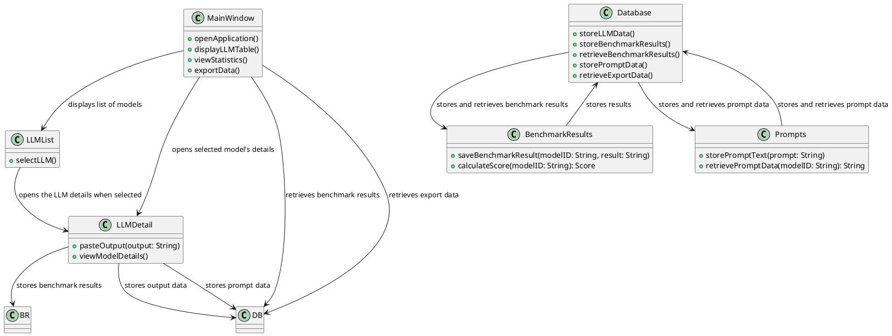

    
...expand whole Sequence Diagram script

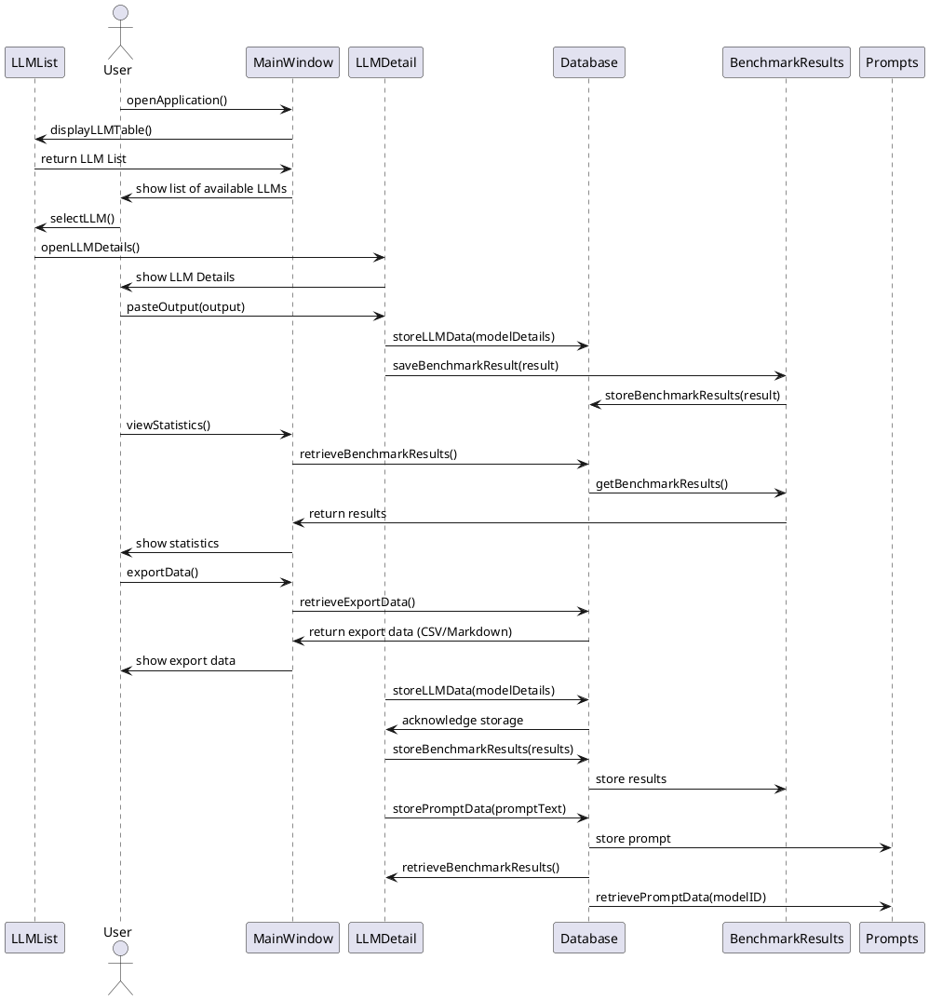

To create a detailed UML and sequence diagram for each component of the Local LLM Playground (LLP) system, we’ll break it down into several parts: the Main Window, LLM List, LLM Detail View, Database, Benchmark Results, and Prompts.

### 1. **Main Window Component UML**

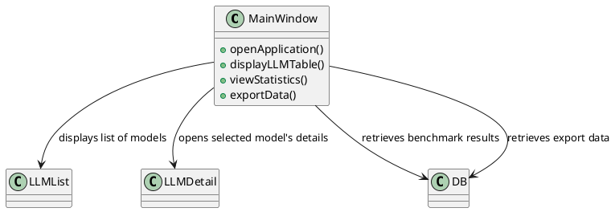

### 2. **LLM List Component UML**

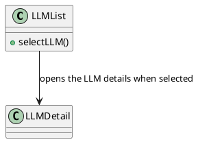

### 3. **LLM Detail View Component UML**

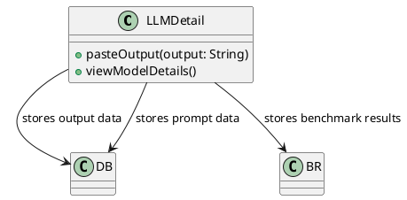

### 4. **Database Component UML**

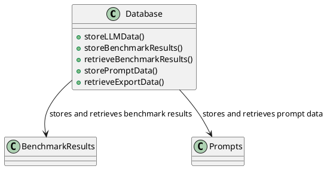

### 5. **Benchmark Results Component UML**

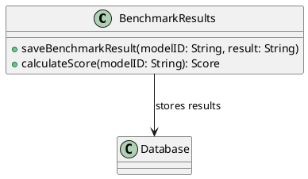

### 6. **Prompts Component UML**

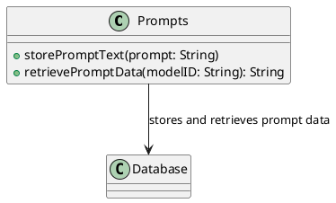

---

## Sequence Diagrams

### 1. **Main Window - Opening the Application and Viewing LLM List**

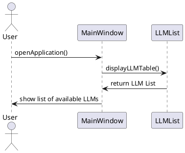

### 2. **LLM List - Selecting an LLM and Viewing Details**

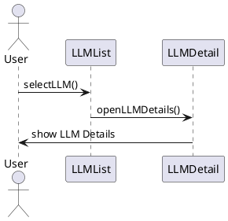

### 3. **LLM Detail View - Pasting Output and Storing Benchmark Results**

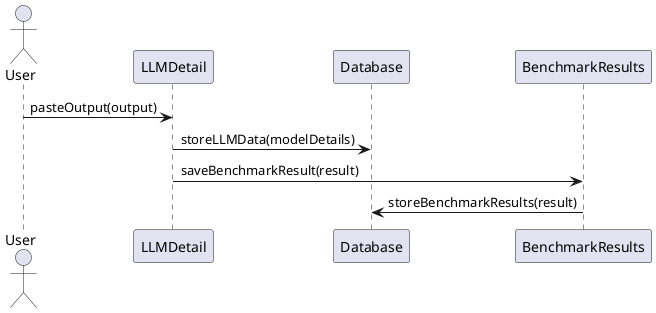

### 4. **Main Window - Viewing Statistics**

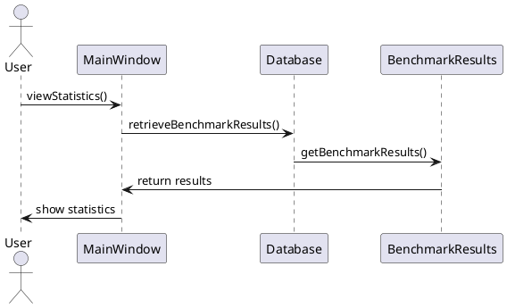

### 5. **Main Window - Exporting Data**

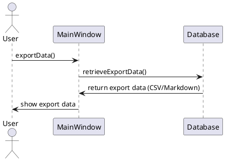

### 6. **Database - Storing and Retrieving Data**

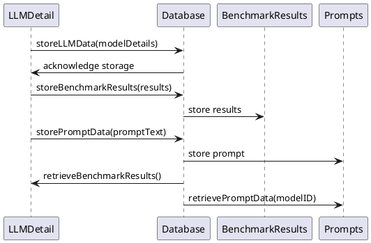

---

### Breakdown of Components in UML and Sequence:

1. **Main Window** handles the user interface. It interacts with the LLM List to display available models and with the LLM Detail View to display the selected model’s details. It also retrieves benchmark statistics and export data from the database.

2. **LLM List** displays all the LLMs. When a user selects a model, it triggers the LLM Detail View.

3. **LLM Detail View** shows the detailed view of a selected model. The user can paste the model's output here, which is then stored in the database. Benchmark results are also saved and calculated in this component.

4. **Database** is responsible for storing and retrieving all necessary data, including LLM details, benchmark results, and prompts.

5. **Benchmark Results** stores benchmark results and calculates scores. It interfaces with the Database for persistent storage.

6. **Prompts** stores the prompt data used during LLM evaluations. It also retrieves prompt data for display in the LLM Detail View.

This architecture uses simple interactions between components to ensure scalability, maintainability, and ease of understanding, adhering to the limitations of using Golang, SQLite, and Fyne as the core technologies for the system.
