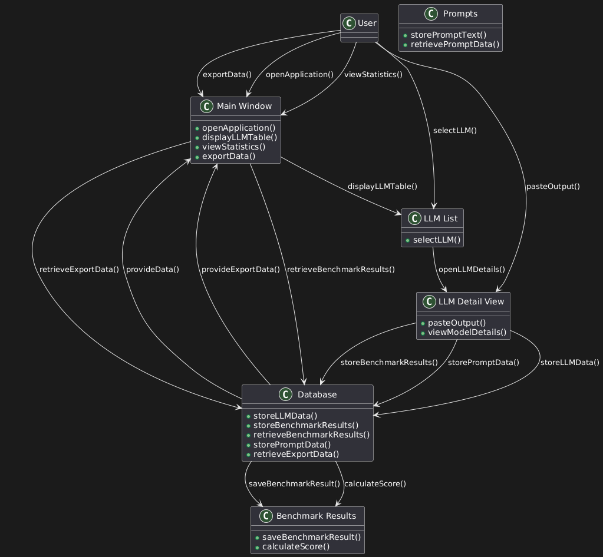
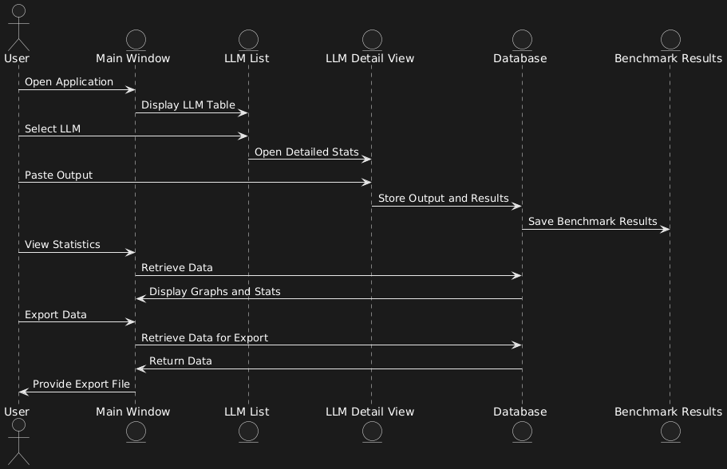
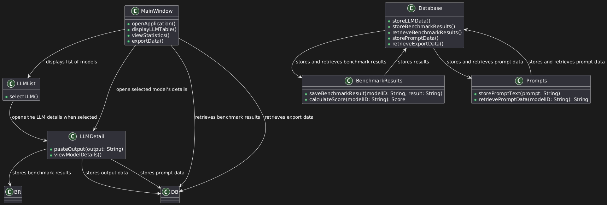
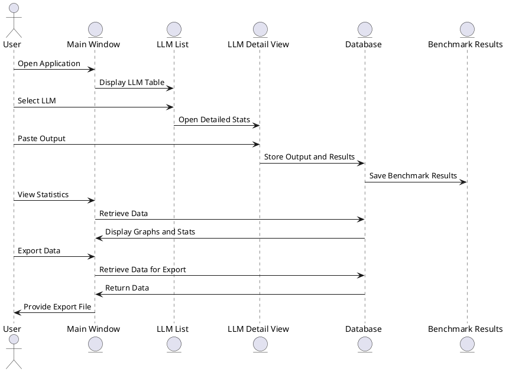
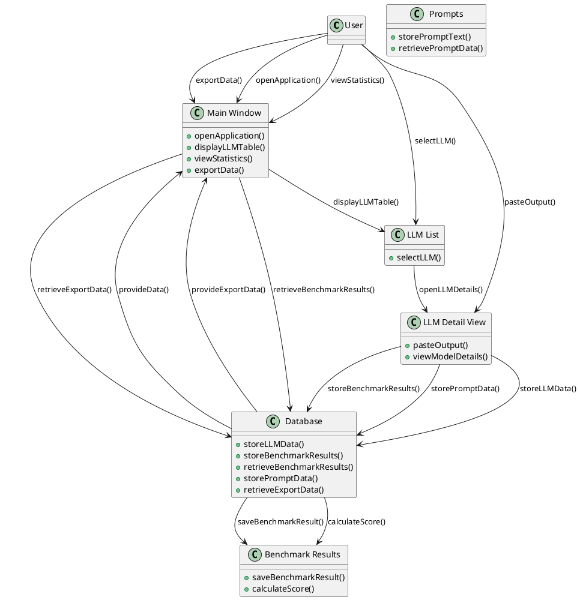

# LLP Design Document

## UI/UX Design

- [`uiux-doc.md`](./uiux-doc.md)

## Schema Design

- [`schema-doc.md`](./schema-doc.md)

## Detailed Design

- [`detailed-doc.md`](./detailed-doc.md)

---

---

Here's a detailed design document for your Local LLM Playground system, focusing on the pure Go and SQLite-based solution, with the Fyne v2 GUI toolkit.

---

## **System Overview**

The Local LLM Playground (LLP) is a native desktop application built with Go and Fyne v2 to manage, benchmark, and interact with local LLMs. It offers a lightweight interface to handle large amounts of model data while ensuring minimal resource consumption. The application uses SQLite as the database for persistent storage and tracking of LLM models and benchmark results.

### **Tech Stack**

- **Backend**: Golang 1.23
- **Frontend**: Fyne v2 GUI Toolkit
- **Database**: SQLite 3.47
- **Diagrams**: PlantUML for sequence and UML diagrams

---

## **System Components**

### **1. User Interface (Fyne v2 GUI Toolkit)**

- **Main Window**: The main UI will consist of a window with multiple panels/tabs to manage and display LLM information, benchmarks, and results.
  - **LLM Table**: Displays a list of all available LLMs with sortable columns (model name, performance, stats, etc.). This table should be scrollable and updateable dynamically.
  - **Model Detail Panel**: Clicking on a row in the LLM table opens a detailed panel showing LLM-specific stats and results.
  - **Statistics Panel**: A page for graphing and displaying various benchmark statistics (using simple text-based charts or basic graph libraries).
  - **Export Options**: Allow users to export benchmark data as markdown or CSV format.

**Screens and Elements**:

- **LLM List Screen**: A simple table with columns like Model Name, Batch Size, Context Length, GPU Usage, Score, etc.
- **LLM Detail View**: Displays detailed stats and a way to paste and save model outputs.
- **Statistics Screen**: Displays charts and graphs related to the benchmark data.

### **2. Backend (Golang)**

- **Database Interaction**: SQLite will be used to store all model data, outputs, and scores.
  - **Tables**:
    - `llms`: Stores LLM model information (ID, Name, Model Version, Parameters, etc.).
    - `benchmark_results`: Stores benchmark results for each LLM (ID, LLM_ID, Score, Timestamp, Output).
    - `prompts`: Stores prompt information (ID, Prompt Text, Expected Output, etc.).
- **Data Processing**: The Go backend will handle all model evaluation, score calculations, and interaction with the database.
  - The benchmark logic will include:
    - Loading model outputs.
    - Parsing and evaluating performance.
    - Storing results and updates.
  - Data is processed and displayed in real-time with live updates to the UI.

### **3. SQLite Database**

- **Schema Design**:

  - `llms` Table:
    - `id INTEGER PRIMARY KEY`
    - `name TEXT`
    - `version TEXT`
    - `model_file_path TEXT`
    - `context_length INTEGER`
    - `batch_size INTEGER`
  - `benchmark_results` Table:

    - `id INTEGER PRIMARY KEY`
    - `llm_id INTEGER (Foreign Key to llms)`
    - `score INTEGER`
    - `output TEXT`
    - `timestamp DATETIME`

  - `prompts` Table:
    - `id INTEGER PRIMARY KEY`
    - `prompt_text TEXT`
    - `expected_output TEXT`
    - `benchmark_result_id INTEGER (Foreign Key to benchmark_results)`

### **4. Core Functionality**

- **LLM Selection**: Users can select different models from the LLM list and view their details.
- **Benchmark Results Calculation**: The application will calculate the benchmark scores in real time, update the LLM table, and display detailed results when needed.
- **Score Calculation**: Based on task-specific evaluation criteria, scores will be calculated for each LLM.
- **Exporting Data**: Users can export LLM data and benchmark results as markdown or CSV files.
- **Data Persistence**: All user-generated data and benchmark results will be saved to SQLite, ensuring persistence across sessions.

### **5. Integration with Model Outputs**

- Users can paste the outputs generated by the LLM into the application.
- The application will automatically capture the outputs, store them in SQLite, and update the relevant data fields.
- Real-time updates will be shown in the UI.

---

## **UI/UX Flow**

1. **Launch the Application**: The user starts the application, and the main window loads.
2. **LLM List**: The user sees a table of all available LLMs.
   - Columns: Model Name, Version, Context Length, Batch Size, Score.
   - Sorting and filtering are available.
3. **Select an LLM**: Clicking on a row opens the model’s detailed stats panel.
   - This panel shows detailed information like model version, scores, context length, and a place to paste output.
4. **Statistics Page**: The user can view charts summarizing benchmark results and model performance.
5. **Export Data**: The user can export the table as markdown or CSV.

---

## **Sequence Diagram (PlantUML)**

---

Here is a complete UML diagram for the entire system, illustrating the architecture and the interactions between different components of the Local LLM Playground (LLP):

### Explanation of the UML Components:

1. **User**: Represents the person interacting with the application. They perform actions like opening the app, selecting LLMs, viewing stats, pasting outputs, and exporting data.
2. **Main Window**: Handles the overall application flow. It coordinates between the LLM List, LLM Detail View, and Benchmark Results views. It also manages exporting data and displaying the benchmark results.
3. **LLM List**: Displays all available models in a table. The user can select any model to view its details.
4. **LLM Detail View**: Shows detailed information about a specific model. The user can paste output from model evaluation and see benchmarks.
5. **Database**: The central data repository for storing LLM information, benchmark results, and prompts. It also handles exporting data.
6. **Benchmark Results**: Stores and calculates benchmark results for LLMs, including score calculation.
7. **Prompts**: Stores the prompts used for LLM evaluations, including prompt text and expected outputs.

### Key Interactions:

- **User to Main Window**: The user interacts with the main window to open the application, display LLM data, view statistics, and export results.
- **Main Window to LLM List**: The main window loads and displays the LLM list.
- **User to LLM List**: The user selects an LLM to view its detailed information.
- **Main Window to LLM Detail View**: Once an LLM is selected, the main window displays detailed information about the model.
- **User to LLM Detail View**: The user pastes output into the detail view, and the model's benchmark results are stored in the database.
- **Database to Benchmark Results**: Benchmark results and score calculations are stored in and retrieved from the database.
- **User to Export**: The user can export benchmark data, which is retrieved from the database and provided back in a format like CSV or Markdown.

This UML diagram gives an overview of how the system is structured and how its components interact.

---

## **Unit Testing and Integration Testing**

- **Unit Tests**: Test individual Go components such as database interaction, score calculation, and data persistence.
- **Integration Tests**: Test the end-to-end flow, ensuring that LLM outputs can be processed, stored, and displayed correctly.

---

## **Conclusion**

This detailed design outlines the components, functionality, and UI/UX flow for the Local LLM Playground system using the specified tech stack. The system will be lightweight, focusing on a native Go and SQLite-based backend with a minimalist Fyne v2 frontend. The system ensures efficient model management, real-time benchmarking, and data persistence without unnecessary bloat.
