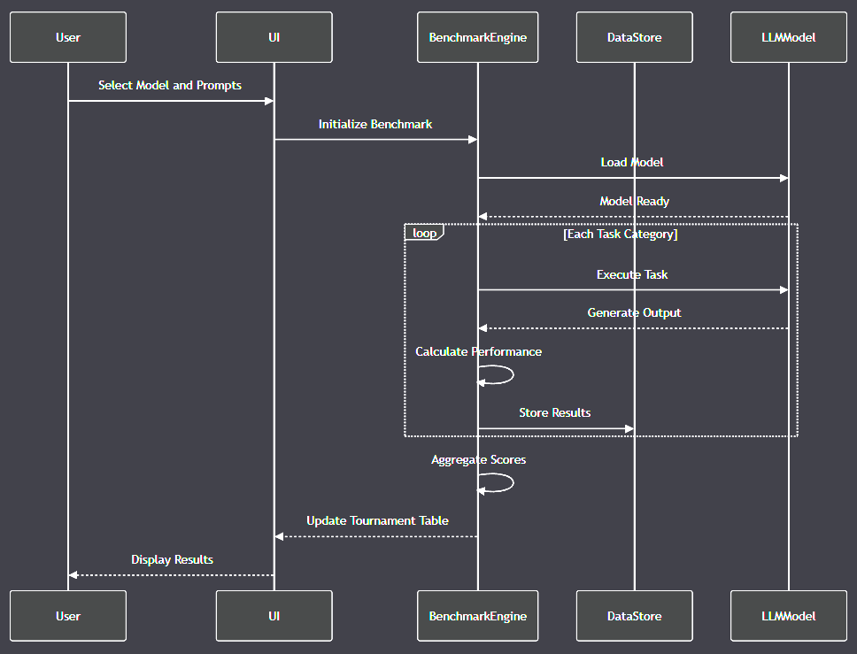

# LLP - Local LLM Playground



## Architecture

- [`architecture.md`](./design/architecture.md)

## UI Mockups

- [`ui_mockups.md`](./design/ui_mockups.md)

## Database Schema

- [`database_schema.sql`](./design/database_schema.sql)

## LLP Project Structure and Initialization

```
llp/
│
├── .github/
│   ├── workflows/
│   │   ├── ci.yml          # Continuous integration configuration
│   │   └── release.yml      # Release build and packaging
│
├── cmd/
│   └── llp/
│       └── main.go          # Application entry point
│
├── internal/
│   ├── models/
│   │   ├── model.go         # LLM model data structure
│   │   ├── task.go          # Task definition and management
│   │   └── result.go        # Benchmark result representation
│
│   ├── database/
│   │   ├── sqlite.go        # SQLite database connection and operations
│   │   └── migrations/
│   │       └── 001_initial_schema.sql  # Database initialization script
│
│   ├── ui/
│   │   ├── tournament.go    # Tournament table view
│   │   ├── ingest.go        # Result ingestion view
│   │   ├── prompts.go       # Prompt management view
│   │   ├── stats.go         # Statistics and visualization
│   │   └── export.go        # Export and reporting
│
│   ├── services/
│   │   ├── ingest_service.go    # Result ingestion logic
│   │   ├── scoring_service.go   # Point calculation service
│   │   └── export_service.go    # Report generation service
│
│   └── utils/
│       ├── validators.go    # Input validation helpers
│       └── logger.go        # Logging utilities
│
├── configs/
│   ├── config.toml          # Application configuration
│   └── default_tasks.json   # Default task definitions
│
├── scripts/
│   ├── install.sh           # System installation script
│   └── setup_db.go          # Database setup and initialization
│
├── tests/
│   ├── integration/
│   │   └── ingest_test.go   # Integration tests
│   └── unit/
│       ├── models_test.go
│       └── services_test.go # Unit tests for core components
│
├── llm_outputs/             # Directory for LLM output storage
│   ├── booting/
│   ├── programming/
│   ├── general/
│   ├── agi/
│   ├── writing/
│   └── swe/
│
├── design/                  # Design documentation
│   ├── ui_mockups.md
│   ├── database_schema.sql
│   └── architecture.md
│
├── assets/                  # Static assets
│   └── icon.png
│
├── go.mod                   # Go module definition
├── go.sum                   # Dependency lockfile
├── Makefile                 # Build and development commands
├── README.md                # Project documentation
└── LICENSE                  # Project licensing
```

## Initialization Script

Here's a recommended `scripts/setup_db.go` to initialize the database:

```go
package main

import (
    "database/sql"
    "log"
    "os"
    "path/filepath"

    _ "github.com/mattn/go-sqlite3"
)

const (
    schemaFile = "../internal/database/migrations/001_initial_schema.sql"
    dbPath     = "../llp.db"
)

func main() {
    // Ensure database directory exists
    dbDir := filepath.Dir(dbPath)
    if err := os.MkdirAll(dbDir, 0755); err != nil {
        log.Fatalf("Failed to create database directory: %v", err)
    }

    // Open database connection
    db, err := sql.Open("sqlite3", dbPath)
    if err != nil {
        log.Fatalf("Failed to open database: %v", err)
    }
    defer db.Close()

    // Read schema file
    schema, err := os.ReadFile(schemaFile)
    if err != nil {
        log.Fatalf("Failed to read schema file: %v", err)
    }

    // Execute schema
    _, err = db.Exec(string(schema))
    if err != nil {
        log.Fatalf("Failed to execute schema: %v", err)
    }

    log.Println("Database initialized successfully")
}
```

## Recommended Initial Configuration

`configs/config.toml`:

```toml
[database]
path = "llp.db"
max_connections = 5

[ui]
theme = "default"
max_results_display = 50

[benchmarks]
output_directory = "llm_outputs"
default_task_categories = [
    "booting",
    "programming",
    "general",
    "agi",
    "writing",
    "swe"
]
```

## Go Module Initialization

```bash
mkdir -p llp
cd llp
go mod init github.com/yourusername/llp
go mod tidy
```

## Next Steps

1. Install dependencies
2. Set up SQLite driver
3. Implement core models
4. Build initial UI components
5. Create database migration scripts

Key Components and Rationale:

1. Organized directory structure following Go best practices
2. Separation of concerns with internal packages
3. Comprehensive test and script directories
4. Configuration management
5. Flexible output storage for benchmark results
6. Database initialization and setup script
7. Extensible design for future improvements
