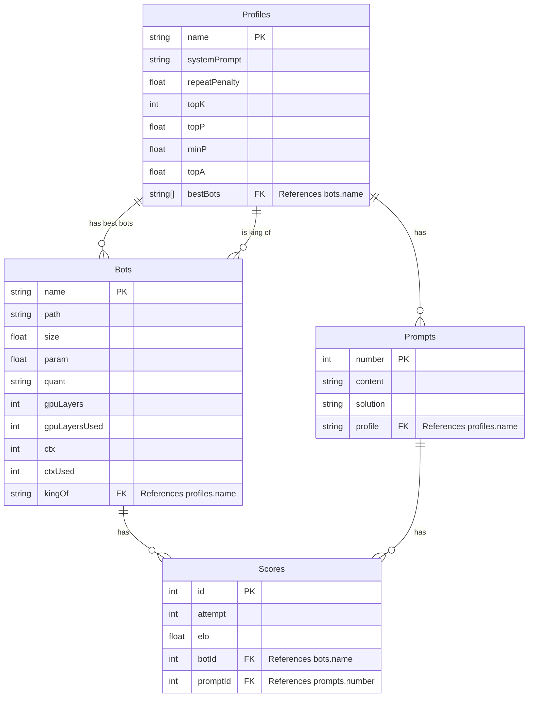

# LLM Becnhmarking App Preliminary Design

## System Design

- bots schema: name, path, size, param, quant, gpuLayers, gpuLayersUsed, ctx, ctxUsed, kingOf (ref profiles.name)
- profiles schema: name, systemPrompt, repeatPenalty, topK, topP, minP, topA, bestBots (ref bots.name)
- prompts schema: number, content, solution, profile (ref profiles.name)
- scores schema: attempt, elo, botId (ref bots.name), promptId (ref prompts.number)

### ER Diagram

## Technical Requirements

- Internal: if not exist, load all required data into the database
  - Bots: in `data/bots.csv`
  - Profiles: in `data/profiles.csv`
  - Prompts: in `data/prompts.csv`
  - Scores: empty
- Home Page:
  - Load Test Scores Button:
    - Mocked Scores: generate mocked attempts (which the elo will be automatically calculated from: 1 attempt = 100 elo, 2 attempts = 50 elo, 3 attemps = 20 elo, 4+ attempts = 0 elo) for all bot-and-prompt combinations
  - Clear Test Data Button: clear all of database and frontend scores data and clear all profiles.bestBots and bots.kingOf
- Model Manager Page: CRUD with database
- Profile Manager Page: CRUD with database
- Prompt Manager Page: CRUD with database
- Leaderboard Page: Bot Name, Profile 1 Elo, Profile N Elo, Total Elo
  - Features: every column can sort; automatically calculate the scores
  - On row clicked: open the Scores Edit panel that ties to the Bot
  - Scores Edit Page:
    - Input: for the user to manually enter their run result, by choose Profile & Prompt, then input no. attempt, then hit Save Button
    - Display: Prompt's content
- Stats Page:
  - Buttons for multiple mode of charts and diagrams
  - Conclude Button:
    - Add top 10 best performant bots to the bestBots list of each Profile.
    - Add the profile name to the kingOf list of the bot that achieve top 1 elo for each profile.
    - Add the title "Lord of LLM" to the bot with highest total elo.
  - Display the section Lord of LLM that show the bot with hightest total elo.
  - Display lists of best 10 bots for each profile
  - Display a line graph for each profile that include all the bots
  - Display a line graph with include all the bots and their total elo

## Tech Stack

- TypeScript latest
- Next.js latest
- Sahdcn/ui latest
- D3.js latest
- Zustand latest
- React-Query latest
- DrizzleORM latest
- SQLite latest
- Vitest latest
- Playright latest

## Non-Technical Requirements

- The app must looks clean and modern and sleek
- The app must be blazingly fast and reactive and responsive
- The app codebase must be as clear and simple as possible but still achive all of the requirements
- It must has dark theme
- Buttons are big and distinct to see
- Fields that enticipate long texts must be large
- The app must be modular and maintainable
- Have logging statements at crucial points of interests
- No need for users or roles logic or fancy security features because this app will only be run locally
