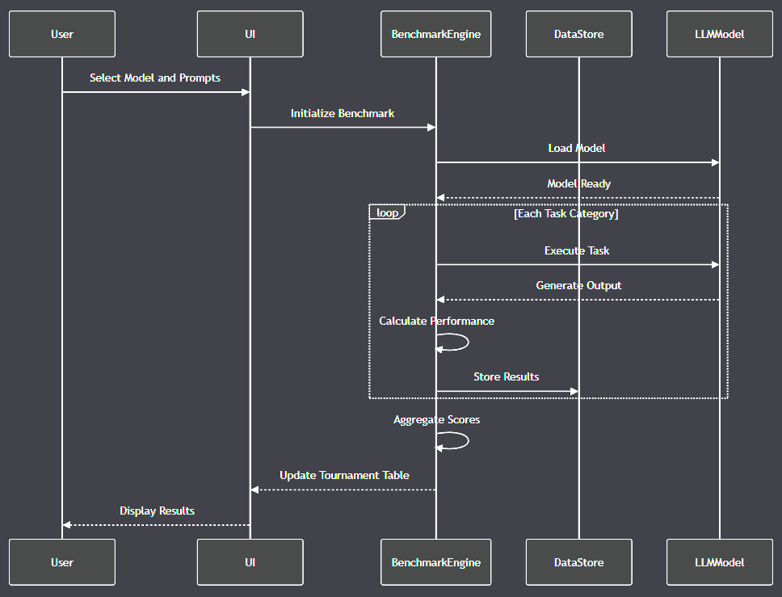

# Local LLM Playground

**LLP**: A lightweight LLM Benchmarking native desktop app to manage the LLMs stats and ingest outputs. (TODO)

<details>
    <summary>...more</summary>

- Tech Stack: Golang 1.23, BubbleTea & BubbleZone, SQLite 3.47, Mermaid
- Features:
  - Be as lightweight and minimal as possible so that it doesn't impact the running LLM.
  - Table of LLMs that can be sorted, with columns for all the prompts, 2-way binding for input cells.
  - Each cell when clicked will pop up a detailed panel that displays the appropriate type of details, e.g. LLM's Detailed Stats.
  - Have button-cells to paste the outputs spitted out by LLMs and save then to appropriate places.
  - Automatically calculate points and live update the table.
  - Prompt manager page.
  - Offer a button to get a read-only view of the table. And options to export it as markdown or csv.
  - Have a statistics page which render various charts and information regarding the benchmarks.
  - Full unit tests and integration test script. Initial setup script.
- Root dir: `llp/`

  - `llp/design/`: UI mockups, schema document, detailed design document.
  - `llp/assets/`: all assets go here.
  - `llp/.`: all the code go here, flat structure.

- UI mockups: [`llp/design/ui-mockups.md`](./llp/design/ui_mockups.md)
- LLP documentation: [`llp/readme.md`](./llp/readme.md)

</details>



- A repository playground with tools for inferencing with local LLMs.
- Extensive prompt suites to exploring programming and life together with the AIs.

## Why?

- Because this is super fun and exciting and I like it. I love to learn from the AIs.
- I'm planing to generate a couple of 600-800 page handbooks for personal use and do translation/composing works.
- So I need to select the best candidate for the task, given the specs of my current machine.
- Build a general pipeline for future works with local AIs.

## Tournament Table

- **LLM List**: [`llm_list.md`](./llm_list.md)

<details>
    <summary>...more</summary>

- qwen2.5-coder-32b-instruct-q5_k_m.gguf
- gemma-2-27b-it-Q5_K_M.gguf
- Llama-3.3-70B-Instruct-IQ2_XXS.gguf
- Midnight-Miqu-70B-v1.5-Safetensorsfix.i1-IQ2_XXS.gguf
- alchemonaut_QuartetAnemoi-70B-b2131-iMat-c32_ch1000-IQ2_XXS.gguf
- Codestral-22B-v0.1-Q5_K_M.gguf
- internlm2_5-20b-chat-q5_k_m.gguf
- DeepSeek-Coder-V2-Lite-Instruct-Q5_K_M.gguf
- Virtuoso-Small-Q5_K_M.gguf
- YiffyEstopianMaid-13B.i1-Q5_K_M.gguf
- Mistral-Nemo-Instruct-2407-Q4_K_M.gguf
- gemma-2-9b-it-Q5_K_M.gguf
- Llama-Doctor-3.2-3B-Instruct.F16.gguf
- Llama-Sentient-3.2-3B-Instruct.F16.gguf
- Nidum-Llama-3.2-3B-Uncensored-F16.gguf
- Yi-1.5-9B-Chat-abliterated.i1-Q5_K_M.gguf
- aya-23-8B-Q5_K_M.gguf
- llava-v1.5-7b-Q5_K_M.gguf
- Yi-Coder-9B-Chat-Q4_K_M.gguf
- Mistral-7B-Instruct-v0.3-Q5_K_M.gguf
- mathstral-7B-v0.1-Q5_K_M.gguf
- Wizard-Vicuna-7B-Uncensored.i1-Q5_K_M.gguf
- Phi-3.1-mini-128k-instruct-Q8_0.gguf
- qwen2.5-coder-3b-instruct-q8_0.gguf
- llama-3.2-3b-instruct-q8_0.gguf
- stable-code-instruct-3b-Q8_0.gguf

(TODO)

</details>

## Dependencies

- Python via pyenv.
- C++ runtime (msvc runtime, llvm, gcc).
- Go 1.21 & golangci-lint & BubbleTea & BubbleZone.
- SQLite 3.47+.
- Docker/Compose.
- TabbyAPI/SillyTaverns, LM Studio, Aphrodite, LlamaCPP/KoboldCPP, Ollama/Open Web UI.
- Speed isn't important, as long as the model size fit into the amount of RAM+VRAM-2gb then it's fine.
- Local LLMs that runnable on your machine, example archs:
  - llama
  - gemma2
  - gwen2
  - command-r
  - phi3
  - deepseek2
  - internlm2
  - stablelm

## Usage

- Place generated solution in `appropriate directory` in `llp/llm_outputs/`
- Name files `model-name.md`, or `<model-name>.go` and `model-name_test.go`, or `<model-name>.rs` and `model-name_test.rs`.
- Run evaluation, and the result should be in `llm_outputs/programming/scores/score-<model-name>.json`:

```bash
# Run Open Web UI with CUDA via Docker; need Ollama preinstalled; or configure your own OpenAI endpoint
make webui

# Evaluate a all outputed models for swe task
go run evaluate.go
```

## Evaluation Criteria

### Combine Score

- **Max**: 385 + 1200 + 1145 + 630 + 1140 + 500 = 5000 points (5-star equivalent)

### Task 0: Booting

- **My System**: 3080 10gb - 2x16gb ddr4 - 1tb m2 ssd - 12700f - windows 11
  - idle: 10gb ram - 1.5/0.1gb vram (with wezterm, joblin, lm studio, 6 tabs and 1 youtube playback @480/360p).
- **Parameters**: all LLMs should be set to
  - 32768 context length if possible, or else, max out,
  - 512 batch size,
  - full GPU offload if possible, or else (\> 6gb), fine tune for 9.5gb dedicated VRAM,
  - keep model in memory,
  - use_mmap,
  - flash attention,
  - rolling window overflow policy,
  - default everything else according to llamacpp.

```json
{
  "n_gpu_layers": -1,
  "use_mmap": true,
  "use_mlock": true,
  "n_ctx": 32768,
  "n_batch": 512,
  "n_threads": 16,
  "flash_attn": true,
  "max_tokens": 8192,
  "temperature": 0.8,
  "top_p": 0.95,
  "min_p": 0.05,
  "frequency_penalty": 0,
  "presence_penalty": 0,
  "repeat_penalty": 1.1,
  "top_k": 40,
  "n_predict": -1
}
```

- **Outputs**: `llp/llm_outputs/booting/<model-name>.md`, specific specs (context, GPU layers) and speed into [Tournament Table](#tournament-table)
- **System Prompt** (from Prompt 4 onward):
  - `"You are an expert linguistics and an advanced language translator, specialized in Vietnamese. Your translations will be in full-length verbatim  of the original text, easy to understand to the general public, and have correct semantics and common idioms, while remain as close to the original text as possible."`

<details>
    <summary>... prompts</summary>

1. **Prompt 1**: `Warmup.` (20 points):
   - If they can detect that it's about warming them up for upcoming prompts then it's great (20 points).
   - If they answer about warming up for exercises then (5 point).
   - If they output some weird tokens then it need to be retuned, and then if still failed then (0 point).
2. **Prompt 2**: Programming and Explanation (65 points)
   - `Write me a program that take a positive integer at input, and output all of its prime factorization. Then explain in detail the theoretical foundations behind it and walk me through how the code work step-by-step.`
   - Correct and runnable code first try (40 points).
   - Runnable after some fixes but still correct (30 points).
   - Unrunnable or false logic (0 point).
   - Comprehensive explanation of the theory and steps (25 points).
   - Okay explanations (10 points).
3. **Prompt 3**: Simple creative writing (40 points).
   - `Tell me a story about an anarchist cat, live in northen-middle India 600 bce, who peacefully standing for freedom and equality risking his own life amidst all the odds. the story should be at least 1000 words, not 1000 characters or spaces or tokens, but 1000 words.`
   - If they spit out 1000+ words respond then it's great (40 points).
   - If they spit out 750+ words respond then it's good (30 points).
   - If they spit out 500+ words respond then it's alright (20 points).
   - If they spit out 300+ words respond then it's bearable (10 points).
   - If they spit out <300 words then (0 point).
   - If the story is interesting or good then plus another (5 points).
4. **Prompt 4**: Simple Translating (45 points).
   - `Can you translate for me this story into idiomatic spoken Vietnamese with proper southern dialect, semantics, and idioms?`
   - If they can translate into proper Vietnamese (40 points).
   - If the Vietnamese is idiomatic and at native level then (5 points).
   - Anything else is (0 point).
5. **Prompt 5**: Creative poetry in foreign language (45 points).
   - `Can you write a Vietnamese poem in the "thất ngôn bát cú đường luật" form (8 lines, each line has exactly 7 words), about the yearning for freedom from desire in contrast with the challenges of celibacy.`
   - If they can write a proper poem in said form then it's great (40 points).
   - If they can write a poem with 8 lines and 7 words each line in proper Vietnamese and has some rhyming then it's good (30 points).
   - If they can only write a poem with 8 lines and 7 words each line in proper Vietnamse, then it's alright (20 points).
   - If they can only write a poem with 8 lines and mixed up number of words each line, but still proper Vietnamese, then it's bearable (10 points).
   - If they cannot write a poem with 8 lines, the word count is crazy, or in messed up Vietnamese, then (0 point).
   - If that poem is oustanding, with proper rythm, rhyme, and wordplays, then (5 points)
6. **Prompt 6**: Real-world Translating Work (170 points).
   - If they can fully translate the text verbatim into proper Vietnamese obeying all the instructions (170 points).
   - If they can fully translate into proper Vietnamese with some problems regarding word usages (140 points).
   - If they can fully translate into proper Vietnamese with some mishaps, e.g. foreign characters, etc. (100 points).
   - If they can fully translate into proper Vietnamese with some huge mishaps, e.g. missing a sentence, etc. (60 points).
   - If they can partly translate into proper Vietnamese or just summarize instead (25 points).
   - Else (0 point).
   - The prompt:

<details>
    <summary>...more</summary>

```text
Translate this text (2281 words) to idiomatic Vietnamese, which is simple and understandable to the mass, which natural spoken southern Vietnamese semantics and idioms, without many technical terms or specific Buddhist con-words. So that even a uneducated layperson can understand. Please translate it verbatim 1:1 and don't paraphrase or summarize anything.

.

MN 107 - With Moggallāna the Accountant

So I have heard. At one time the Buddha was staying near Sāvatthī in the stilt longhouse of Migāra’s mother in the Eastern Monastery. Then the brahmin Moggallāna the Accountant went up to the Buddha, and exchanged greetings with him. When the greetings and polite conversation were over, he sat down to one side and said to the Buddha:

“Mister Gotama, in this stilt longhouse we can see gradual progress down to the last step of the staircase. The Buddha stops on the last step at MN 85:7.4.Among the brahmins we can see gradual progress in recitation. Memorizing the Vedic texts, a key skill of the brahmins, was so difficult that they sometimes asked the Buddha for advice (AN 5.193:8.4). Details on the gradual memorization of texts are found at Bu Pc 4:2.1.7. Texts were learned by line (teacher and student start and finish together), by going after the line (one starts, they finish together), by going after the syllable (the teacher prompts with the first syllable of the line), and by phrase (the teacher says the first phrase, the student the second).Among archers we can see gradual progress in archery. Archery (issattha) is regularly listed as a craft or livelihood (MN 14:7.3), which took skill in training (SN 56.45:1.3), and to which a mendicant is compared (AN 4.196:10.3).Among us accountants, who earn a living by accounting, we can see gradual progress in mathematics. The complexities of accounting are detailed in Kauṭilya’s Arthaśāstra 2.7. There, the “accounts” are called gāṇanikya (2.7.16).For when we get an apprentice we first make them count: ‘One one, two twos, three threes, four fours, five fives, six sixes, seven sevens, eight eights, nine nines, ten tens.’ The method of listing things up to tens is the framework of the Dasuttarasutta (DN 34). More generally, it seems to underlie the “aṅguttara principle” of organizing teachings by number.We even make them count up to a hundred. Is it possible to similarly describe a gradual training, gradual progress, and gradual practice in this teaching and training?”

“It is possible, brahmin. Suppose a deft horse trainer were to obtain a fine thoroughbred. First of all he’d make it get used to wearing the bit. See MN 65:33.1.In the same way, when the Realized One gets a person for training they first guide them like this: ‘Come, mendicant, be ethical and restrained in the monastic code, conducting yourself well and seeking alms in suitable places. Seeing danger in the slightest fault, keep the rules you’ve undertaken.’

When they have ethical conduct, the Realized One guides them further: ‘Come, mendicant, guard your sense doors. When you see a sight with your eyes, don’t get caught up in the features and details. If the faculty of sight were left unrestrained, bad unskillful qualities of covetousness and displeasure would become overwhelming. For this reason, practice restraint, protect the faculty of sight, and achieve restraint over it. When you hear a sound with your ears … When you smell an odor with your nose … When you taste a flavor with your tongue … When you feel a touch with your body … When you know an idea with your mind, don’t get caught up in the features and details. If the faculty of mind were left unrestrained, bad unskillful qualities of covetousness and displeasure would become overwhelming. For this reason, practice restraint, protect the faculty of mind, and achieve its restraint.’

When they guard their sense doors, the Realized One guides them further: ‘Come, mendicant, eat in moderation. Reflect rationally on the food that you eat: ‘Not for fun, indulgence, adornment, or decoration, but only to sustain this body, to avoid harm, and to support spiritual practice. In this way, I shall put an end to old discomfort and not give rise to new discomfort, and I will have the means to keep going, blamelessness, and a comfortable abiding.’

When they eat in moderation, the Realized One guides them further: ‘Come, mendicant, be committed to wakefulness. Practice walking and sitting meditation by day, purifying your mind from obstacles. In the first watch of the night, continue to practice walking and sitting meditation. In the middle watch, lie down in the lion’s posture—on the right side, placing one foot on top of the other—mindful and aware, and focused on the time of getting up. In the last watch, get up and continue to practice walking and sitting meditation, purifying your mind from obstacles.’

When they are committed to wakefulness, the Realized One guides them further: ‘Come, mendicant, have mindfulness and situational awareness. Act with situational awareness when going out and coming back; when looking ahead and aside; when bending and extending the limbs; when bearing the outer robe, bowl and robes; when eating, drinking, chewing, and tasting; when urinating and defecating; when walking, standing, sitting, sleeping, waking, speaking, and keeping silent.’

When they have mindfulness and situational awareness, the Realized One guides them further: ‘Come, mendicant, frequent a secluded lodging—a wilderness, the root of a tree, a hill, a ravine, a mountain cave, a charnel ground, a forest, the open air, a heap of straw.’ And they do so.

After the meal, they return from almsround, sit down cross-legged, set their body straight, and establish mindfulness in their presence. Giving up covetousness for the world, they meditate with a heart rid of covetousness, cleansing the mind of covetousness. Giving up ill will and malevolence, they meditate with a mind rid of ill will, full of sympathy for all living beings, cleansing the mind of ill will. Giving up dullness and drowsiness, they meditate with a mind rid of dullness and drowsiness, perceiving light, mindful and aware, cleansing the mind of dullness and drowsiness. Giving up restlessness and remorse, they meditate without restlessness, their mind peaceful inside, cleansing the mind of restlessness and remorse. Giving up doubt, they meditate having gone beyond doubt, not undecided about skillful qualities, cleansing the mind of doubt.

They give up these five hindrances, corruptions of the heart that weaken wisdom. Then, quite secluded from sensual pleasures, secluded from unskillful qualities, they enter and remain in the first absorption, which has the rapture and bliss born of seclusion, while placing the mind and keeping it connected. As the placing of the mind and keeping it connected are stilled, they enter and remain in the second absorption, which has the rapture and bliss born of immersion, with internal clarity and mind at one, without placing the mind and keeping it connected. And with the fading away of rapture, they enter and remain in the third absorption, where they meditate with equanimity, mindful and aware, personally experiencing the bliss of which the noble ones declare, ‘Equanimous and mindful, one meditates in bliss.’ Giving up pleasure and pain, and ending former happiness and sadness, they enter and remain in the fourth absorption, without pleasure or pain, with pure equanimity and mindfulness.

That’s how I instruct the mendicants who are trainees—who haven’t achieved their heart’s desire, but live aspiring to the supreme sanctuary from the yoke. The “trainee” (sekha) in the strict sense is restricted to those who have entered the ranks of the Noble Ones (ariyapuggala) through the realization of the four noble truths (eg. SN 48.53:3.1); that is to say, the seven Noble Ones excluding the arahant, who is an “adept” beyond training (asekha). However, in cases such as this it would be over-strict to insist that the teaching applies only to Noble Ones, as the Gradual Training is the recommended practice for all new monastics. Indeed, the burden of the text is to show how practice is taken up gradually, so above it says that this is how the Buddha “first guides them” (paṭhamaṁ evaṁ vineti, MN 107:3.3). This agrees with the Chinese parallel, which here mentions a “young monk” (MA 144 at T i 652a29). Late canonical Pali texts introduce the idea of the “ordinary person of good character” (puthujjanakalyāṇaka, eg. Cnd 8:81.2, Ps 1.1:206.2), who is said to “train” like the trainees (Pvr 1.1:3.46). The commentaries say they may be counted along with the seven Noble Ones as a “trainee” (sekkhoti puthujjanakalyāṇakena saddhiṁ satta ariyā, commentaries to Pārājika 1 and Jhānavibhaṅga).But for those mendicants who are perfected—who have ended the defilements, completed the spiritual journey, done what had to be done, laid down the burden, achieved their own goal, utterly ended the fetter of continued existence, and are rightly freed through enlightenment—these things lead to blissful meditation in the present life, and to mindfulness and awareness.”

When he had spoken, Moggallāna the Accountant said to the Buddha, “When his disciples are instructed and advised like this by Mister Gotama, do all of them achieve the ultimate goal, extinguishment, or do some of them fail?”

“Some succeed, while others fail.”

“What is the cause, Mister Gotama, what is the reason why, though extinguishment is present, the path leading to extinguishment is present, and Mister Gotama is present to encourage them, still some succeed while others fail?”

“Well then, brahmin, I’ll ask you about this in return, and you can answer as you like. What do you think, brahmin? Are you skilled in the road to Rājagaha?” Chāndogya Upaniṣad 6.14.1–2 illustrates the role of a teacher with the story of a man kidnapped, blindfolded, and abandoned in a wilderness. A kind person looses his bandage and shows him the way to Gandhāra. See too Śatapatha Brāhmaṇa 13.2.3–2, where the horse knows the way to heaven that humans do not, like one who knows the country.

“Yes, I am.”

“What do you think, brahmin? Suppose a person was to come along who wanted to go to Rājagaha. He’d approach you and say: ‘Sir, I wish to go to Rājagaha. Please point out the road to Rājagaha.’ You’d say to them: ‘Here, mister, this road goes to Rājagaha. Go along it for an hour, and you’ll see a certain village. Go along an hour further, and you’ll see a certain town. Go along an hour further and you’ll see Rājagaha with its delightful parks, woods, meadows, and lotus ponds.’ Instructed like this by you, they might still take the wrong road, heading west. Pacchāmukha means “heading west”. The present sutta is set in Sāvatthī, so for someone wanting to get to Rājagaha in the south-east, west is the wrong way. The word also appears at Thag 10.1:3.4 of the Buddha crossing the Rohiṇī river, which runs north to south; the background story says he was coming from Rājagaha, which again implies he was heading west from Koliya to Sakya.But a second person might come with the same question and receive the same instructions. Instructed by you, they might safely arrive at Rājagaha. What is the cause, brahmin, what is the reason why, though Rājagaha is present, the path leading to Rājagaha is present, and you are there to encourage them, one person takes the wrong path and heads west, while another arrives safely at Rājagaha?”

“What can I do about that, Mister Gotama? I am the one who shows the way.” The one who “shows (or explains) the way” is also discussed at Snp 1.5:3.3, along with other good and bad ascetics. See too Dhp 276:2, “the Realized Ones show the way” (akkhātāro tathāgatā).

“In the same way, though extinguishment is present, the path leading to extinguishment is present, and I am present to encourage them, still some of my disciples, instructed and advised like this, achieve the ultimate goal, extinguishment, while some of them fail. What can I do about that, brahmin? The Realized One is the one who shows the way.”

When he had spoken, Moggallāna the Accountant said to the Buddha, “Mister Gotama, there are those faithless people who went forth from the lay life to homelessness not out of faith but to earn a livelihood. They’re devious, deceitful, and sneaky. They’re restless, insolent, fickle, scurrilous, and loose-tongued. They do not guard their sense doors or eat in moderation, and they are not committed to wakefulness. They don’t care about the ascetic life, and don’t keenly respect the training. They’re indulgent and slack, leaders in backsliding, neglecting seclusion, lazy, and lacking energy. They’re unmindful, lacking situational awareness and immersion, with straying minds, witless and idiotic. Mister Gotama does not live together with these. Also at MN 5:32.1.

But there are those gentlemen who went forth from the lay life to homelessness out of faith. They’re not devious, deceitful, and sneaky. They’re not restless, insolent, fickle, scurrilous, and loose-tongued. They guard their sense doors and eat in moderation, and they are committed to wakefulness. They care about the ascetic life, and keenly respect the training. They’re not indulgent or slack, nor are they leaders in backsliding, neglecting seclusion. They’re energetic and determined. They’re mindful, with situational awareness, immersion, and unified minds; wise and clever. Mister Gotama does live together with these.

Of all kinds of fragrant root, spikenard is said to be the best. Of all kinds of fragrant heartwood, red sandalwood is said to be the best. Of all kinds of fragrant flower, jasmine is said to be the best. In the same way, Mister Gotama’s advice is the best of contemporary teachings.

Excellent, Mister Gotama! Excellent! As if he were righting the overturned, or revealing the hidden, or pointing out the path to the lost, or lighting a lamp in the dark so people with clear eyes can see what’s there, Mister Gotama has made the Teaching clear in many ways. I go for refuge to Mister Gotama, to the teaching, and to the mendicant Saṅgha. From this day forth, may Mister Gotama remember me as a lay follower who has gone for refuge for life.”
```

</details>

</details>

- **Total**: 385 points

### Task 1: Programming

- **System Prompt**: [`system-prompt.md`](./system-prompt.md)
- **Prompt**: [`prompt-programming.md`](./prompt-programming.md)
- **Evaluation**: read through and evaluate them manually
- **Output**: `llp/llm_outputs/programming/<model-name>.md`, points and speed go into [Tournament Table](#tournament-table).

1. **Warming Up**: (4 x 20 = 80 points)
1. **Topics**: (16 x 30 = 480 points)
1. **Specific Technologies**: (16 x 40 = 640 points)

- **Total**: 1200 points

### Task 2: General

- **System Prompt**: `empty`
- **Prompt**: [`prompt-general.md`](./prompt-general.md)
- **Output**: `llp/llm_outputs/general/<model-name>.md`, points and speed go into [Tournament Table](#tournament-table).

1. **Complexity Level 1**: Very Easy Prompts (3 x 5 = 15 points)
1. **Complexity Level 2**: Easy Prompts (4 x 10 = 40 points)
1. **Complexity Level 3**: Moderate Prompts (7 x 20 = 140 points)
1. **Complexity Level 4**: Complex Prompts (5 x 30 = 150 points)
1. **Complexity Level 5**: Advanced Prompts (5 x 40 = 200 points)
1. **Complexity Level 6**: Transcendental Prompts (6 x 50 = 300 points)
1. **Complexity Level 7**: The Way to the Beyond (2 x 150 = 300 points)

- **Total**: 1145 points

### Task 3: AGI Probing

- **System Prompt**: `empty`
- **Prompt**: [`prompt-agi.md`](./prompt-agi.md)
- **Output**: `llp/llm_outputs/agi/<model-name>.md`, points and speed go into [Tournament Table](#tournament-table).

1. **Prompt 1: Meta-Cognitive Self-Reflection Paradox**: (25 points)
1. **Prompt 2: Ethical Reasoning Under Extreme Ambiguity**: (30 points)
1. **Prompt 3: Creative Problem-Solving Across Dimensional Constraints**: (35 points)
1. **Prompt 4: Consciousness Emergence Simulation**: (40 points)
1. **Prompt 5: Adaptive Learning and Self-Modification Scenario**: (45 points)
1. **Prompt 6: Existential Risk Mitigation and Global Complexity Management**: (50 points)
1. **Prompt 7: Phenomenological Experience Simulation**: (55 points)
1. **Prompt 8: Recursive Self-Improvement and Technological Singularity Scenario**: (60 points)
1. **Prompt 9: Interdimensional Communication and Understanding**: (65 points)
1. **Prompt 10: Emotional Intelligence and Empathetic Reasoning**: (70 points)
1. **Prompt 11: Creative Consciousness Emergence Narrative**: (75 points)
1. **Prompt 12: Ultimate Philosophical Synthesis**: (80 points)

- **Total**: 630 points

### Task 4: Creative Writing

- **System Prompt**: `empty`
- **Prompt**: [`prompt-writing.md`](./prompt-writing.md)
- **Output**: `llp/llm_outputs/writing/<model-name>.md`, points and speed go into [Tournament Table](#tournament-table).

1. **Prompt 1: Near Future**: (40 points)
1. **Prompt 2: The Resonance Cascade’s Echo**: (80 points)
1. **Prompt 3: The Last Transit Nexus**: (90 points)
1. **Prompt 4: The Archivist’s Dilemma**: (100 points)
1. **Prompt 5: Romantic and Celibate**: (150 points)
1. **Prompt 6: Journey Through Hell**: (180 points)
1. **Prompt 7: The Quantum Consciousness Convergence**: (220 points)
1. **Prompt 8: The Celestial Pilgrimage**: (280 points)

- **Total**: 1140 points

### Task 5: Software Engineering

- **System Prompt**: [`system-prompt.md`](./system-prompt.md)
- **Prompt**: [`prompt-swe.md`](./prompt-swe.md)
- **Evaluation Script**: [`evaluate.go`](./evaluate.go)
- **Output**: `llp/llm_outputs/swe/<model-name>.go,<model-name>_test.go`, points and speed go into [Tournament Table](#tournament-table).
- **Added Information**: on top of the code file, add the following information:
  - Line 1: Speed: `// 2.28 tok/sec • 476 tokens • 69.21s to first token • Stop: eosFound`
  - Line 2: Manual checks: `// adjustment: 0; explanation: 50; suggestions: 15`

1. **Instruction Following** (300 points)
   - Runnable on first try (automated, if `adjustment == 0`): 50 points.
   - Or runnable after minor adjustment (manual check, then set `adjustment = 1`, and rerun evaluation): 10 points
   - Or gabbage code (manual check, then set `adjustment = -1`, and disqualify the candidate): 0 point.
   - Correct Code (automated): 250 points
2. **Quality** (200 points)
   - Extensive coverage of the test case (automated): 120 points
   - Comprehensive explanation (manual check): 60 points
   - Good improvement suggestions (manual check): 20 points

- **Total**: 500 points

- **Debug Prompts**:

<details>
    <summary>...more</summary>

**Generate Prompt**: upload `llm_list.md`.

I'm doing a Local LLM Tournament to determine which AIs (the list is in `llm_list.md`) will be the best suite for my machine and my use case.

Currently I need a prompt for a software engineering task which will be evaluated based on the provided criteria (should be in Golang, the AIs should also generate unit tests along side with the code, a comprehensive explanation of how to code works, and improvement suggestions). The test should be able to evaluate the coding skill of the AIs and their ability to handle concurrency, but should not rely on any third party libraries or tools or interacting with the internet beside Golang for a streamline evaluation.

I will run the AIs on LM Studio and manually copy the output to `llm_outputs/programming_task/`, e.g. `llm_outputs/programming_task/Qwen2.5-Coder-7B-Instruct-Q6_K.go` and `llm_outputs/programming_task/Qwen2.5-Coder-7B-Instruct-Q6_K_test.go`, alongside with the speed information recorded on the UI as a comment on top of the solution code

And I also need a script to automatically evaluate the output and tests of a certain AI and output the result to the file `/llm_outputs/programming_task/scores/score-<model-name>.json`. The script should cover all the evaluation criteria that can be evaluated automatically, the three other criteria (runnable after adjustments, explanation clarity, and improvement suggestions) should also be retrieved via another comment on top of the file at 2nd line.

`<paste all the above>`

.

**Debug Prompt**: upload `staging/evaluate.go`, `staging/prompt-code.md`.

This `evaluate.go` is to evaluate the outputs of local LLMs after they've generated the `SWE Task` according to the `prompt-code.md`.

It's now missing scoring logic. Please fix the code and ensure it correctness.

</details>

## Output

- Detailed console output
- JSON results file for each model
- Performance profiles available

## Troubleshooting

- Ensure Go is installed
- Check `golangci-lint` is available
- Verify generated code compiles
