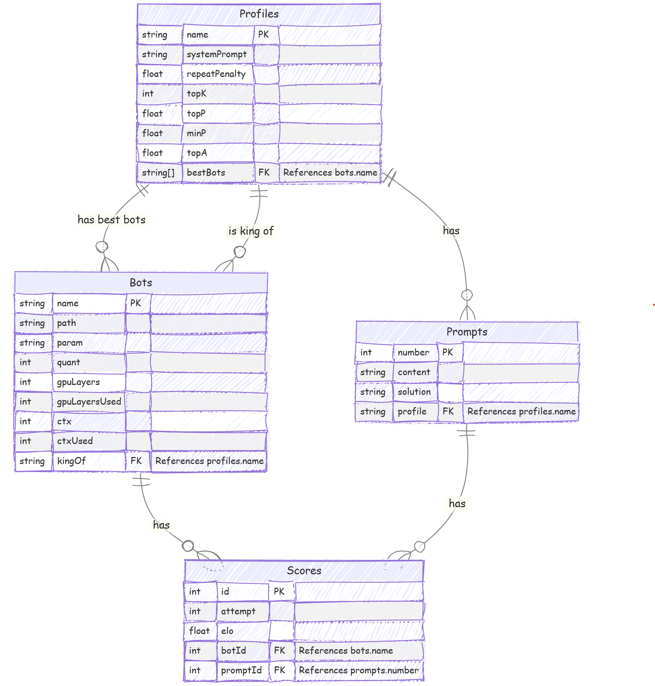

# Local LLM Playground

## Benchmarking, Profiles, and Prompt Suites

- Full solution dataset and evaluation methodology: [`profiles.md`](./profiles.md) & [`prompts.md`](./prompts.md).

  - 7 comprehensive specialized system prompt and sampler profiles.
  - 33 quality prompts divided into 7 groups.

- Quickly chat with a local LLM with correct sampler profile (7-10 tps on 8gb vram system):

  - any kind of conversation with [`converse.ps1`](./converse.ps1)
  - or translate a text to Vietnamese with [`translate.ps1`](./translate.ps1)
  - or do quick programming task with [`code.ps1`](./code.ps1)
  - Required `llama.cpp`, `Tiger Gemma 9B v3`, `Aya Expanse 8B`, `Codegeex4 All 9B`.
  - Edit the rootPath in `shared.ps1`. Manually switch the profile and model path.

- Server-only run with a specific preconfigured model recipe with `llama-server` API in [`llm_recipes/`](./llm_recipes) directory.

- Powered by:

  - **Local Dev**: Neovim, Aider, MistralAPI Free _(500,000 tpm - 1,000,000,000 tpM)_, GeminiAPI Free _(10 rpm, 1500 rpd)_, Crawl4AI
  - **Local Gen**: LlamaCpp + _{a set of best local models}_, LM Studio _(to manage GGUFs)_, AnythingLLM, SillyTavern/Agnai, StableDiffusionWebUIForge, FluxDev + ControlNets/LoRAs
  - **External Chat**: AIStudio, ChatGPT, ClaudeAI, CopilotChat, Cohere, Mistral, DeepSeek, SambaNova, Groq, GLHF.
  - **Extras**: ProjectIDX, Cline, OpenCanvas, MetaGPT, DeepInfra (non-free), Twitter's Grok, Facebook's Llama

- **LLM Benchmarking** [`preliminary_design.md`](./preliminary_design.md)

- `npm install && npm run dev` to start `LLM Benchmarking` app on localhost:

  - TypeScript, Next.js
  - Sahdcn/ui, D3.js
  - Zustand, React-Query
  - DrizzleORM, SQLite
  - Vitest, Playright

## Tooling

- Directory structure:

  - `assets/`: all assets.
  - `llm_reciples/`: all preconfigured LLM's llama-server running scripts. (based on my specs)
  - `llm_outputs/`: all LLM outputs.
  - `models.md` & `data/bots.csv`
  - `prompts.md` & `data/prompts.csv`
  - `profiles.md` & `data/profiles.csv`
  - `converse.ps1`
  - `translate.ps1`
  - `code.ps`
  - `t5_runner.py`: GUI to run T5 models for direct translating from English to Vietnamese
  - `temp.py`: temporary stores AI's output for evaluation.

- A playground for conducting (manual as of now) tournaments of the local LLMs.
- Extensive prepared prompt suites for streamlining LLM testing.

### Why?

- Do translation/composing works.
- Learn new languages and skills.
- Use AIs as a copilot to engineer software and compose documentation.
- Generate a couple of 600-1000 page books for personal use.
- So need to select the best candidate for the task, given the specs of the local machine.
- There for, prompt suites and tournament pipeline is necessary
- In conclusion, build a general pipeline for future works with local AIs.

### Dependencies

- Python3.12 via pyenv
- `pip install llama-cpp-python --prefer-binary --extra-index-url=https://jllllll.github.io/llama-cpp-python-cuBLAS-wheels/AVX2/cu122`
- `pip install transformers ctransformers accelerate sentencepiece bitsandbytes tk requests Pillow`
- `pip install torch torchvision torchaudio --index-url https://download.pytorch.org/whl/cu124`
- `pip install flash-attn --no-build-isolation`
- `pip install grouped_gem`
- Node.js
- C++ runtime (msvc runtime or llvm).
- C# and .NET MAUI.
- (Docker/Compose) if use Ollama.
- **Neovim/Aider/Mistral/Crawl4AI**, **LlamaCpp/SillyTavern**, TabbyAPI/Exllamav2, Vllm/Aphrodite (Linux), Ollama/Open Web UI, LM Studio/AnythingLLM, etc.
- HuggingFace, CivitAI, stable-diffusion-webui-forge, ComfyUI, SwarmUI, Speed isn't important, as long as it can run then it's fair game.
- Local LLMs with highest quant that runnable on your machine, example archs: llama, gemma2, command-r, gwen2, deepseek2, phi3, mamba, internlm2, stablelm, t5, bart

## LLM Benchmarking

## Tournament Leaderboard

### TODO

- Desktop app or spreadsheet for managing and visualizing the tournament

### Free LLM API list:

    
...more

#### GLHF

1. Llama 3.1 405B Instruct
1. Deepseek 2.5
1. Aria
1. Command R Plus
1. Athene v2 Chat
1. Magnum v4 123B
1. Llama 3.1 Nemotron 70B Instruct HF

#### Mistral

1. Mistral Large 2411
1. Mistral 8x22B
1. Codestral

#### Groq

1. Llama 3.2 90B Text Preview
1. Llama 3.3 70B Versatile

#### SambaNova Cloud

1. LLama 3.2 90B Vision Instruct
1. Qwen 2.5 72B Instruct
1. QwQ 32B Preview

#### Google AI Studio or Project IDX

1. Gemini 2.0 Flash Experimental
1. Gemini Experimental 1206
1. Gemini 2.0 Flash Thinking Experimental

#### DeepSeek

1. DeepSeek-R1-Lite-Preview

#### Big Brother

1. ChatGPT 4o
1. Claude 3.5 Sonnet
1. Copilot Chat

### Local LLMs list:

    
...more

#### 12B - 70B

- Llama-3.1-Nemotron-70B-Instruct-HF-IQ2_M (24.12 GB)
- Llama-3.3-70B-Instruct.i1-IQ2_M (24.12 GB)
- Qwen2.5-32B-Instruct-Q5_K_L (23.74 GB)
- Mistral-Small-Instruct-2409-Q8_0 (23.64 GB)
- Codestral-22B-v0.1-Q8_0 (23.64 GB)
- Mistral-Small-22B-ArliAI-RPMax-v1.1-q8_0 (23.64 GB)
- aya-expanse-32b-Q5_K_L (23.56 GB)
- c4ai-command-r-08-2024-Q5_K_L (23.56 GB)
- magnum-v4-27b-Q6_K_L (22.63 GB)
- Mixtral-8x7B-Instruct-v0.1-exhaustive-LoRA.i1-IQ3_M (21.43 GB)
- qwen2.5-coder-14b-instruct-q8_0 (15.70 GB)
- Virtuoso-Small-Q8_0 (15.70 GB)
- phi-4-Q8_0 (15.58 GB)
- Mistral-Nemo-Instruct-2407-Q8_0 (13.02 GB)
- Rocinante-12B-v1.1-Q8_0 (13.02 GB)
- NemoMix-Unleashed-12B-Q8_0 (13.02 GB)

#### 4B - 11B

- Moistral-11B-v3-Q8_0 (11.40 GB)
- codegeex4-all-9b-Q8_0 (9.99 GB)
- Tiger-Gemma-9B-v3-Q8_0 (9.83 GB)
- Darkest-muse-v1-Q8_0 (9.83 GB)
- aya-expanse-8b-Q8_0 (8.54 GB)
- c4ai-command-r7b-12-2024-q8_0 (8.54 GB)
- L3-8B-Stheno-v3.2-Q8_0-imat (8.54 GB)
- Hermes-3-Llama-3.1-8B-Q8_0 (8.54 GB)
- Ministral-8B-Instruct-2410-Q8_0 (8.53 GB)
- Nemotron-Mini-4B-Instruct-f16 (8.39 GB)
- Qwen2.5-Coder-7B-Instruct-Q8_0 (8.10 GB)
- SeaLLMs-v3-7B-Chat-Q8_0 (8.10 GB)
- Llava-v1.5-7B-Q8_0 (7.79 GB)
- falcon-mamba-7b-instruct-Q8_0 (7.77 GB)
- codeqwen-1_5-7b-chat-q8_0 (7.71 GB)
- mathstral-7B-v0.1.Q8_0 (7.70 GB)
- rho-math-7b-v0.1-Q8_0 (7.70 GB)

#### 0.1B - 3.8B

- Phi-3.5-mini-instruct.f16 (7.64 GB)
- Ministral-3b-instruct.f16 (6.63 GB)
- Hermes-3-Llama-3.2-3B-f16 (6.43 GB)
- Llama-Doctor-3.2-3B-Instruct-f16 (6.43 GB)
- Qwen2.5-Coder-3B-Instruct-f16 (6.18 GB)
- SmolLM2-1.7B-Instruct-f16 (3.42 GB)
- Llama-3.2-1B-Instruct-f16 (2.48 GB)
- Qwen2.5-Coder-0.5B-Instruct-f16 (994.16 MB)
- Qwen2.5-0.5B-Instruct-f16 (994.16 MB)
- SmolLM2-360M-Instruct-f16 (725.55 MB)
- SmolLM2-135M-Instruct-f16 (270.89 MB)

